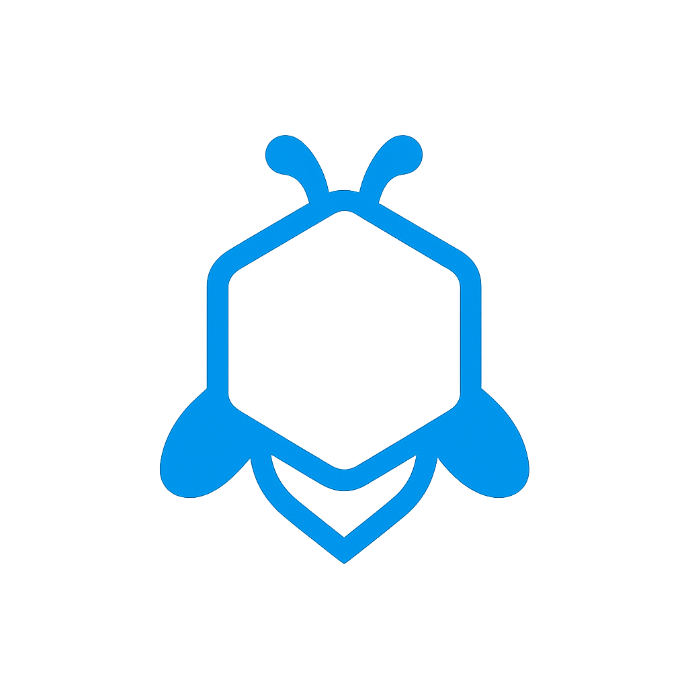
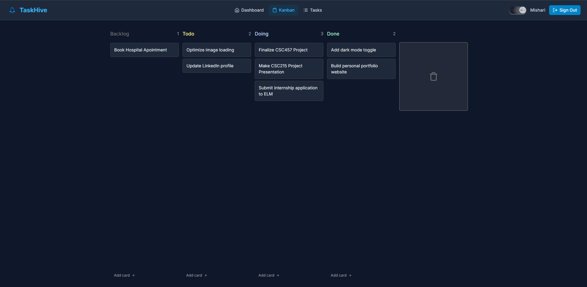
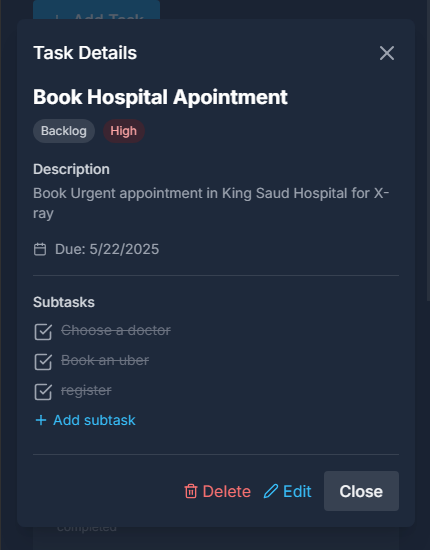
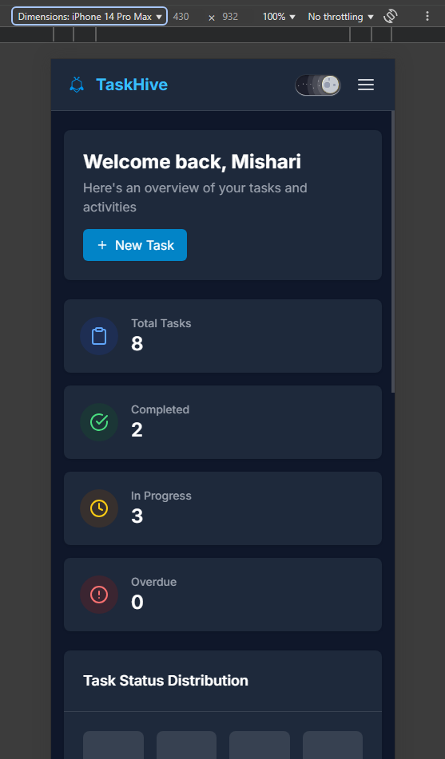

# TaskHive

 

**A Minimalist Task Management System**

_Designed to meet the needs of 80% of users with only 20% of the complexity._

<br clear="left" />

[](https://taskhive.albuhairi.me/)
[](LICENSE)

</br>

## Team

| Team Member | UID | Role |
|-------------|-----|------|
| Mishari Khalid Albuhairi | 443102188 | Frontend Development, Docker Deployment |
| Anas Obaid Muqtif | 443106490 | Backend Development, Database Design |

## Quick Start

### Live Demo
Visit [TaskHive](https://taskhive.albuhairi.me/) to see it in action!

### Local Setup

```bash
# Clone the repository
git clone https://github.com/yourusername/taskhive.git
cd taskhive

# Frontend Setup
cd frontend
npm install
npm run dev

# Backend Setup (XAMPP required)
# Set up PHP backend with Apache/MySQL
```

## Features

- **User Authentication** - Secure registration and login system  
- **Task Management** - Create, update, and delete tasks with customizable statuses and priorities
- **Kanban Board** - Visual task organization with drag-and-drop functionality
- **Dashboard Analytics** - Visual representations of task distribution and completion rates
- **Responsive Design** - Works seamlessly on desktop and mobile devices
- **Dark/Light Theme** - Comfortable viewing in any environment

## Tech Stack

### Frontend
- **React** - Frontend framework
- **Vite** - Build tool
- **Tailwind CSS** - Styling
- **React Router** - Navigation
- **Axios** - HTTP client
- **Framer Motion** - Animations

### Backend
- **PHP** - RESTful API
- **MySQL** - Database

## Screenshots

### Dashboard


### Kanban Board


### Task Details


### Mobile View


## Documentation

### API Endpoints

- `POST /api/auth/login` - User login
- `POST /api/auth/register` - User registration
- `GET /api/tasks` - Get all tasks
- `POST /api/tasks` - Create new task
- `PUT /api/tasks/:id` - Update task
- `DELETE /api/tasks/:id` - Delete task

## Design System

### Color Palette
- **Primary**: `#0284c7` (Sky Blue)
- **Background**: `#FFFFFF` (Light) / `#1e293b` (Dark)
- **Text**: `#111827` (Light) / `#F9FAFB` (Dark)

### Typography
- **Font Family**: Inter (sans-serif)
- **Sizes**: 12px to 24px for various elements


